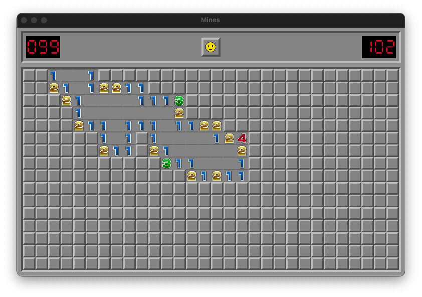

# mines

A minesweeper clone in C. The graphical layer is handled by raylib.
The project is strictly a learning exercise. Should get some decent C knowlege
out of it.



# Build

To build the project, run make

``` shell
make
```

This should build the `mines` executable. Then just run it:

``` shell
./mines
```

# TODO

[ ] Show all unmarked mines if loss
[ ] Show incorrecly marked mines if loss
[ ] Show animation on win
[ ] Add actual flag image to cells when marking
[ ] Chord reveal all neigbors
[ ] In game restart
[ ] In game difficulty option
[ ] High scores
[ ] Enable timekeeping
[ ] Enable mines remaining counter
